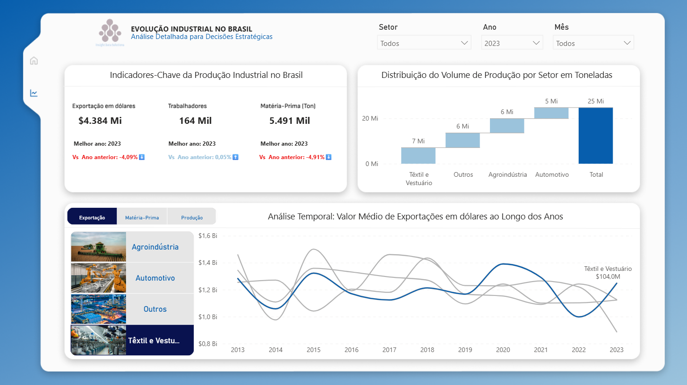

# Produção Industrial no Brasil — Visualização Interativa

[Acesse aqui o painel desse projeto](https://app.powerbi.com/view?r=eyJrIjoiMjliMmM5YzItMWM2OS00MTUzLThiMmQtZjAxOTE3N2NlY2JlIiwidCI6IjE0NTkzZjgwLTI2NDEtNDQzYy1hOTAzLWQzNGMyNzE1NDdjYSJ9)

Neste projeto, exploramos dados relacionados à produção industrial de diversos setores no Brasil ao longo dos últimos 10 anos. A proposta é desenvolver um painel interativo que permita a análise de tendências, comparações entre setores e identificação de padrões relevantes para a tomada de decisão.

A solução foi pensada para atender tanto públicos executivos quanto técnicos, permitindo diferentes níveis de exploração e profundidade analítica.

O objetivo principal é fornecer uma ferramenta que facilite a **tomada de decisão estratégica**, com base em indicadores como:

- Volume de produção
- Número de trabalhadores
- Uso de matéria-prima
- Valor de exportações

## Objetivo

Permitir a exploração de tendências e comparações entre setores industriais usando visualizações intuitivas no Power BI, com dados gerados artificialmente e um design baseado em boas práticas de UX/UI.

## Hipóteses e Perguntas de Análise

A partir do conjunto de dados sobre produção industrial, este projeto explora questões relevantes para executivos e analistas de negócios:

1. Como a produção industrial evoluiu ao longo dos últimos 10 anos no Brasil?
2. Quais setores mais cresceram em termos de volume de produção e exportações?
3. Houve impacto perceptível da pandemia em determinados setores industriais?
4. Existe correlação entre o uso de matéria-prima e o volume produzido?
5. Há sazonalidade ou padrões cíclicos entre os setores?

Essas perguntas orientaram o design do painel e das interações propostas no Power BI.

## Ferramentas Utilizadas

- **Python**: geração de dados sintéticos e preparação dos dados.
- **Power BI**: construção da visualização interativa.
- **Figma**: criação do mockup inicial e wireframe da interface.
- **DAX e M (Power Query)**: para modelagem de dados e interatividade.
- **Git/GitHub**: versionamento do projeto e documentação.

## Estrutura do Projeto

| Pasta         | Descrição |
|---------------|-----------|
| `data/`       | [Contém os dados sintéticos gerados.](data/) |
| `notebooks/`  | [Notebook Jupyter para gerar os dados com Python.](notebooks/) |
| `pbix/`       | [Arquivo Power BI com o painel interativo.](pbix/) |
| `mockups/`    | [Mockup da interface criado no Figma.](https://www.figma.com/community/file/1522211247084638581/dashboard-mockups-producao-industrial) |
| `scripts/`    | [Scripts em Python para limpeza e normalização.](scripts/) |
| `images/`     | [Imagens utilizadas no README ou dashboard.](images/) |
| `docs/`       | Documentação original do case e sua resposta. |

## Painel Publicado

🔗 [Veja o painel interativo no Power BI Service](https://app.powerbi.com/view?r=eyJrIjoiMjliMmM5YzItMWM2OS00MTUzLThiMmQtZjAxOTE3N2NlY2JlIiwidCI6IjE0NTkzZjgwLTI2NDEtNDQzYy1hOTAzLWQzNGMyNzE1NDdjYSJ9)

## Fluxo de Desenvolvimento

1. **Definição do problema**: extraído do case técnico.
2. **Geração e limpeza de dados** com Python.
3. **Criação do mockup** em Figma com foco em acessibilidade e usabilidade.
4. **Construção do painel** no Power BI.
5. **Publicação e compartilhamento** com a comunidade.

## Página de análises do Painel

## Análise Exploratória dos Dados Industriais

O notebook [analise_setorial_producao_industrial.ipynb](notebooks/analise_setorial_producao_industrial.ipynb) realiza uma análise exploratória detalhada com base em dados sintéticos simulando a produção industrial brasileira entre 2013 e 2023. Ele responde a cinco perguntas-chave:

Questões respondidas:
Como a produção industrial evoluiu ao longo dos últimos 10 anos?
- Crescimento geral com variações entre setores.

Quais setores mais cresceram em volume e exportações?
- Destaque para Agroindústria e Automotivo, com volume e valor exportado em alta.

Houve impacto perceptível da pandemia?
- Queda em 2020, com retomada clara nos anos seguintes, especialmente no setor Têxtil.

Existe correlação entre uso de matéria-prima e produção?
- Sim. Correlação forte em todos os setores (R² > 0.92).

Há sazonalidade nos setores?
- Sim. Meses como janeiro, novembro e dezembro concentram picos de produção.

### Conclusão:
Os dados sintéticos se mostraram consistentes e úteis para fins de visualização, com padrões realistas e insights replicáveis. Este notebook pode ser base para construção de dashboards em Power BI ou estudos analíticos mais avançados.

## Aprendizados

- Como balancear interatividade e simplicidade em visualizações executivas.
- Importância de consistência visual e narrativa no design de painéis.
- Validação e controle de qualidade de dados fictícios para protótipos reais.

---
## Autor

**Gilnei Alves de Freitas**  
Analista de Dados Sênior  

---

## Licença

Este projeto é de uso demonstrativo para fins de portfólio e aprendizado. Os dados utilizados foram fictícios ou anonimizados.

---